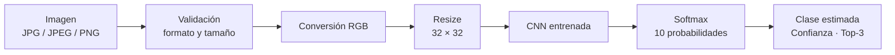
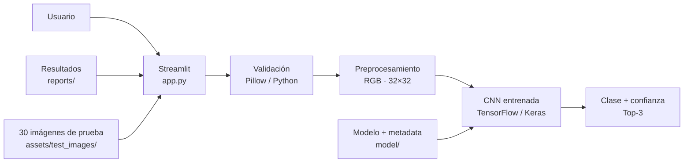

<div align="center">

# Eikonorasís CIFAR-10 akrivís

### Clasificación multiclase mediante Xception + Transfer Learning + fine-tuning controlado y fine-tuning sobre CIFAR-10

Aplicación web interactiva desarrollada en **Python**, **TensorFlow/Keras** y **Streamlit** para clasificar imágenes en las diez categorías de CIFAR-10, visualizar la confianza de la predicción y documentar el entrenamiento y la evaluación del modelo.

[](https://www.python.org/)
[](https://www.tensorflow.org/)
[](https://keras.io/)
[](https://streamlit.io/)
[](https://scikit-learn.org/)
[](https://archive.ics.uci.edu/dataset/691/cifar+10)

**Instituto Internacional de Aguascalientes**  
Maestría en Inteligencia Artificial para la Transformación Digital · Aprendizaje Profundo

[Aplicación](https://eikonorasis-cifar10.streamlit.app/) ·
[Repositorio](https://github.com/edtech-mx-ve/eikonorasis-cifar10) ·
[Institución](https://www.iinternacional.edu.mx/) ·
[Dataset UCI](https://archive.ics.uci.edu/dataset/691/cifar+10) ·
[Kaggle CIFAR-10](https://www.kaggle.com/c/cifar-10)

</div>

---

## Nombre oficial de la aplicación

**Eikonorasís CIFAR-10 akrivís**

### Nombre recomendado para Streamlit

**Eikonorasís CIFAR-10 akrivís — Visión por Computadora**

Subtítulo recomendado:

> Clasificación multiclase mediante Xception + Transfer Learning adaptado a CIFAR-10.

Descripción corta:

> Aplicación académica de visión por computadora para clasificar imágenes de CIFAR-10 mediante Xception, Transfer Learning y fine-tuning controlado.

---


## Estado del proyecto

**Eikonorasís CIFAR-10** se encuentra funcional, validada localmente y desplegada públicamente en **Streamlit Community Cloud**. La modelo final Xception ya fue entrenada y evaluada, y la aplicación puede utilizarse directamente desde navegador.

**Aplicación pública:** https://eikonorasis-cifar10.streamlit.app/

**Repositorio:** https://github.com/edtech-mx-ve/eikonorasis-cifar10

La aplicación utiliza directamente el modelo entrenado:

```text
model/cnn_cifar10.keras
```

Para utilizar la interfaz web **no es necesario volver a entrenar el modelo**.

---

## ¿Qué hace Eikonorasís CIFAR-10?

Eikonorasís clasifica una imagen dentro de las diez categorías de CIFAR-10:

`Avión` · `Automóvil` · `Ave` · `Gato` · `Ciervo` · `Perro` · `Rana` · `Caballo` · `Barco` · `Camión`

La aplicación:

- permite utilizar **30 imágenes precargadas** para realizar pruebas rápidas;
- permite **subir imágenes JPG, JPEG o PNG** de hasta 5 MB;
- valida el archivo antes de procesarlo;
- convierte la imagen a RGB;
- redimensiona la entrada a `160 × 160`;
- ejecuta la CNN entrenada;
- muestra la **clase estimada**;
- muestra la **confianza** de la clase principal;
- muestra el **Top-3** de clases con mayor probabilidad;
- mantiene una evaluación rápida independiente para las imágenes precargadas;
- mantiene un registro temporal independiente para las imágenes subidas;
- documenta dataset, arquitectura, entrenamiento, evaluación, limitaciones y ayuda.

> **Importante:** Eikonorasís no es un clasificador universal. El modelo fue entrenado únicamente sobre las diez clases de CIFAR-10. Una probabilidad Softmax alta expresa la preferencia del modelo entre esas diez categorías, pero no garantiza que una imagen externa pertenezca realmente al dominio de entrenamiento.

---

## Flujo general de inferencia



En forma compacta:

```text
Imagen
→ validación
→ RGB
→ 32×32
→ CNN
→ Softmax
→ clase + confianza + Top-3
```

---

## Modelo evaluador

El evaluador final utiliza **Xception + Transfer Learning + fine-tuning controlado** para la clasificación multiclase de CIFAR-10.

Flujo de inferencia:

```text
Imagen → RGB → 160×160 → Xception → Transfer Learning
→ fine-tuning → Dense(10) + Softmax → predicción y confianza
```

Parámetros principales:

| Elemento | Configuración |
|---|---|
| Modelo | `model_final.keras` |
| Arquitectura base | Xception |
| Pesos iniciales | ImageNet |
| Entrada | RGB `160×160×3` |
| Salida | 10 clases |
| Clasificador | Dense(10) + Softmax |
| Top-k | 3 |

## ¿Cómo aprende la CNN?

Los filtros convolucionales no fueron definidos manualmente. Sus pesos y sesgos se ajustaron durante el entrenamiento mediante retropropagación y optimización con Adam.

```text
45,000 imágenes de entrenamiento
            ↓
       CNN inicial
            ↓
Sparse categorical crossentropy
            ↓
     Backpropagation
            ↓
          Adam
            ↓
pesos y sesgos aprendidos
            ↓
model/cnn_cifar10.keras
            ↓
      inferencia web
```

Las primeras capas aprenden patrones locales como bordes, contrastes y texturas; las capas posteriores combinan esas respuestas en representaciones visuales progresivamente más abstractas.

---

## Integración tecnológica implementada

Eikonorasís separa interfaz, validación, inferencia, persistencia y presentación de resultados.

| Capa | Tecnología / artefacto | Responsabilidad |
|---|---|---|
| Interfaz | Streamlit / `app.py` | Navegación, carga de imágenes, resultados y documentación |
| Validación | Python / Pillow | Formato, tamaño y contenido real de imágenes |
| Preprocesamiento | Pillow + NumPy | Conversión RGB y redimensionamiento |
| Deep Learning | TensorFlow / Keras | CNN entrenada e inferencia |
| Evaluación | scikit-learn / pandas | Métricas, matriz de confusión y análisis |
| Persistencia | Keras + JSON | Modelo final y metadatos |
| Visualización | Streamlit + Matplotlib | Métricas, curvas, tablas e imágenes |
| Versionado | Git / GitHub | Código y artefactos esenciales |
| Despliegue | Streamlit Community Cloud | Ejecución pública prevista |



**Flujo tecnológico resumido:**

```text
Usuario
→ Streamlit
→ validación
→ preprocesamiento
→ TensorFlow/Keras
→ predicción
```

---

## Dataset CIFAR-10

CIFAR-10 contiene **60,000 imágenes RGB de 32×32 píxeles**, distribuidas equilibradamente en diez categorías.

### Clases

1. Avión
2. Automóvil
3. Ave
4. Gato
5. Ciervo
6. Perro
7. Rana
8. Caballo
9. Barco
10. Camión

### Partición oficial y partición utilizada

CIFAR-10 proporciona:

| Partición oficial | Imágenes |
|---|---:|
| Entrenamiento | 50,000 |
| Prueba | 10,000 |

Para el proyecto, las 50,000 imágenes oficiales de entrenamiento se dividieron de forma estratificada:

| Partición del proyecto | Imágenes | Uso |
|---|---:|---|
| Entrenamiento | **45,000** | Aprendizaje de parámetros |
| Validación | **5,000** | Control de generalización |
| Prueba oficial | **10,000** | Evaluación final independiente |

```text
CIFAR-10
│
├── Train ........ 45,000
├── Validation ...  5,000
└── Test ......... 10,000
```

El conjunto oficial de prueba se mantuvo separado durante el entrenamiento y la selección del modelo.

### Carga utilizada durante el desarrollo

La implementación carga CIFAR-10 mediante TensorFlow/Keras:

```python
from tensorflow.keras.datasets import cifar10

(x_train, y_train), (x_test, y_test) = cifar10.load_data()
```

No es necesario almacenar las 60,000 imágenes de CIFAR-10 dentro del repositorio público.

---

## Fuentes y crédito del dataset

### Fuente académica principal

**UCI Machine Learning Repository — CIFAR-10**

<https://archive.ics.uci.edu/dataset/691/cifar+10>

UCI documenta CIFAR-10 como un conjunto de **60,000 imágenes a color de 32×32 píxeles**, organizado en **10 clases**, con 50,000 ejemplos de entrenamiento y 10,000 de prueba.

**Referencia sugerida:**

> *CIFAR-10* [Dataset]. (2009). UCI Machine Learning Repository. https://doi.org/10.24432/C5889J

**DOI:** <https://doi.org/10.24432/C5889J>

### Referencia práctica complementaria

**Kaggle — CIFAR-10 Object Recognition in Images**

<https://www.kaggle.com/c/cifar-10>

Kaggle se utiliza como referencia complementaria para consultar el problema de reconocimiento de objetos y el contexto práctico de clasificación.

---

## Dataset visual adicional para pruebas de la app

La interfaz incluye **30 imágenes externas precargadas**, tres por cada categoría.

Se encuentran en:

```text
assets/test_images/
```

y están renombradas como:

```text
img_test1.png
...
img_test30.png
```

Su finalidad es acelerar las pruebas funcionales de inferencia y permitir una evaluación rápida durante una sesión.

La aplicación muestra:

- archivo seleccionado;
- clase esperada;
- clase predicha;
- confianza;
- acierto/error;
- accuracy rápida de la sesión.

> Este dataset visual adicional **no sustituye ni se mezcla con las 10,000 imágenes oficiales de prueba de CIFAR-10** utilizadas para las métricas finales.

---

## Preprocesamiento y aumento de datos

El preprocesamiento principal está integrado en la red para mantener consistencia entre entrenamiento e inferencia.

### Normalización

```text
RGB original: 0–255
        ↓
Rescaling(1/255)
        ↓
RGB normalizado: 0–1
```

### Data augmentation durante el entrenamiento

Se aplican exclusivamente sobre el conjunto de entrenamiento:

- `RandomFlip("horizontal")`
- `RandomTranslation(0.05, 0.05)`

Validación y prueba no reciben aumentos aleatorios.

Esto ayuda a mejorar la generalización y evita introducir transformaciones aleatorias en la evaluación final.

---

## Entrenamiento

El entrenamiento definitivo utilizó:

```text
45,000 imágenes → entrenamiento
5,000 imágenes  → validación
10,000 imágenes → prueba reservada
```

La CNN se entrenó durante **30 épocas**.

### Resultado final del entrenamiento

| Métrica | Resultado |
|---|---:|
| Épocas completadas | **30** |
| Train accuracy final | **69.78 %** |
| Validation accuracy final | **72.64 %** |
| Validation loss final | **0.7784** |
| Learning rate inicial | `0.001` |

El mejor `val_loss` se obtuvo en la época 30, por lo que los pesos de esa época quedaron almacenados como modelo final.

---

## Evaluación final

La evaluación formal del **modelo final Xception** estableció:

| Indicador | Resultado |
|---|---:|
| Accuracy de validación | **91.10 %** |
| Accuracy en test CIFAR-10 | **90.36 %** |
| Objetivo de referencia | **92 %** |
| Clases | **10** |
| Imágenes del test oficial | **10,000** |

El **90.36 %** es el desempeño final establecido del proyecto. El objetivo de referencia de 92 % no fue alcanzado y queda documentado como parte del resultado final; no constituye una tarea pendiente de la interfaz.

## Análisis de resultados

### Fortalezas

- CNN diseñada específicamente para el proyecto.
- Separación entrenamiento / validación / prueba.
- Semilla fija para reproducibilidad.
- Data augmentation aplicado solo a entrenamiento.
- Dropout para regularización.
- Evaluación independiente sobre 10,000 imágenes.
- Uso de múltiples métricas.
- Matriz de confusión y análisis de errores.
- Resultados de validación y prueba consistentes.

### Limitaciones

- CIFAR-10 utiliza imágenes de solo **32×32 píxeles**.
- El modelo reconoce únicamente diez categorías.
- Fotografías, ilustraciones o imágenes externas pueden diferir de la distribución de CIFAR-10.
- Una probabilidad Softmax alta no equivale a certeza fuera del dominio de entrenamiento.
- La arquitectura es compacta y no pretende competir con modelos convolucionales de gran escala.

### Posibles mejoras

- incorporar Batch Normalization;
- probar una CNN más profunda;
- optimizar learning rate y otros hiperparámetros;
- experimentar con regularización adicional;
- comparar experimentalmente con ResNet o VGG;
- aplicar técnicas de calibración de probabilidades;
- evaluar de forma sistemática imágenes externas al dominio CIFAR-10.

---

## Artefactos de evaluación

La app consume directamente los resultados persistidos en:

```text
reports/
├── history.csv
├── metrics.json
├── classification_report.csv
├── confusion_matrix.png
└── prediction_errors.csv
```

Estos archivos permiten mostrar dentro de la interfaz:

- resultados del entrenamiento;
- curvas de accuracy y loss;
- métricas finales;
- métricas por clase;
- matriz de confusión;
- análisis de errores;
- fortalezas, limitaciones y posibles mejoras.

---

## Fundamento de la salida Softmax

La capa final de la CNN contiene diez neuronas, una por cada clase de CIFAR-10:

```python
Dense(10, activation="softmax")
```

Antes de aplicar Softmax, la red genera un vector de diez valores:

$$
z = (z_1, z_2, \ldots, z_{10})
$$

Estos valores se denominan **logits**. Softmax transforma cada logit en una probabilidad:

$$
p_i = \frac{e^{z_i}}{\sum_{j=1}^{10} e^{z_j}}
$$

Las probabilidades resultantes satisfacen:

$$
\sum_{i=1}^{10} p_i = 1
$$

La aplicación selecciona como predicción principal la clase con mayor probabilidad y muestra además las tres clases con mayor probabilidad estimada mediante el **Top-3**.

---

## Funcionalidades y navegación de la app

La interfaz principal contiene ocho pestañas:

| Pestaña | Propósito |
|---|---|
| **Clasificar** | Ejecutar inferencia con imágenes precargadas o imágenes propias |
| **Dataset** | Consultar características de CIFAR-10, particiones, clases y fuentes |
| **Modelo** | Revisar la arquitectura CNN y sus hiperparámetros |
| **Entrenamiento y evaluación** | Consultar métricas, curvas, matriz de confusión y análisis |
| **Acerca de** | Conocer propósito, alcance y privacidad de la aplicación |
| **Trivia** | Explorar el origen del nombre Eikonorasís y el significado conceptual del logo |
| **Ayuda** | Consultar funcionamiento, tecnologías y glosario |
| **Institucional** | Revisar contexto académico, autoría e identificación técnica |

### Clasificar — Imágenes precargadas

Flujo:

```text
Explorar imagen
→ previsualizar
→ seleccionar
→ analizar
→ comparar esperado vs. predicho
→ evaluación rápida de la sesión
```

La evaluación rápida utiliza las 30 imágenes externas incluidas para pruebas funcionales y se mantiene separada del conjunto oficial de prueba de CIFAR-10.

### Clasificar — Subir imagen

Flujo:

```text
Subir archivo
→ validar
→ previsualizar
→ analizar
→ clase + confianza + Top-3
→ registro temporal de la sesión
```

El registro temporal de imágenes subidas es independiente de la evaluación rápida de las imágenes precargadas.

---

## Organización de la pestaña Ayuda

La pestaña **Ayuda** está dividida en tres sub-secciones:

| Sub-sección | Contenido |
|---|---|
| **Cómo funciona** | Inicio rápido, uso de Imágenes precargadas, uso de Subir imagen e interpretación de confianza y Top-3 |
| **Tecnologías** | Integración tecnológica implementada, responsabilidades por capa e identificación técnica |
| **Glosario** | Definiciones breves de los conceptos utilizados en CNN, entrenamiento, evaluación e inferencia |

### Cómo funciona

Resume el flujo operativo de la app y explica la diferencia entre:

- **clase esperada**;
- **clase estimada**;
- **confianza**;
- **Top-3**;
- **Evaluación rápida de esta sesión**;
- **Registro temporal de imágenes subidas**.

### Tecnologías

Documenta la integración técnica del proyecto:

| Capa | Tecnología / artefacto | Responsabilidad |
|---|---|---|
| Interfaz | Streamlit / `app.py` | Navegación, carga de imágenes, resultados y documentación |
| Validación | Python / Pillow | Formato, tamaño y contenido real de imágenes |
| Preprocesamiento | Pillow + NumPy | Conversión RGB y redimensionamiento a 32×32 |
| Deep Learning | TensorFlow / Keras | CNN entrenada e inferencia multiclase |
| Evaluación | scikit-learn / pandas | Métricas, matriz de confusión y análisis de errores |
| Persistencia | Keras + artefactos de evaluación | Modelo final y resultados persistidos |
| Visualización | Streamlit + Matplotlib | Métricas, curvas, tablas e imágenes |
| Versionado | Git / GitHub | Código y artefactos esenciales |
| Despliegue | Streamlit Community Cloud | Ejecución pública de la aplicación |

Flujo tecnológico resumido:

```text
Usuario
→ Streamlit
→ validación
→ preprocesamiento
→ TensorFlow/Keras
→ predicción
```

### Glosario

Incluye términos clave utilizados en la aplicación, entre ellos:

`CNN` · `CIFAR-10` · `Preprocesamiento` · `Data augmentation` · `Conv2D` · `Kernel` · `ReLU` · `MaxPooling` · `GlobalAveragePooling` · `Dropout` · `Softmax` · `Accuracy` · `Precision` · `Recall` · `F1-score` · `Matriz de confusión` · `Inferencia` · `Confianza` · `Top-3` · `Generalización` · `Sobreajuste`

---

## Institucional

La pestaña **Institucional** documenta el contexto académico del proyecto.

### Proyecto académico

**INSTITUTO INTERNACIONAL DE AGUASCALIENTES**  
Maestría en Inteligencia Artificial para la Transformación Digital

**Asignatura:** Aprendizaje Profundo  
**Aplicación:** Eikonorasís CIFAR-10  
**Proyecto:** Diseño, implementación, entrenamiento, evaluación y despliegue web de una red neuronal convolucional en Python para la clasificación multiclase de imágenes mediante CIFAR-10.

### Autoría académica

**Alumno:** Antonio Nicolás Toro González  
**Tutora:** Dra. Claudia Andrea Vidales Basurto

### Identificación técnica

| Componente | Tecnología / referencia |
|---|---|
| Lenguaje | Python 3.11 |
| Modelo | CNN propia para clasificación multiclase |
| Deep Learning | TensorFlow / Keras |
| Preprocesamiento | Pillow + NumPy |
| Evaluación | scikit-learn + pandas |
| Interfaz web | Streamlit |
| Dataset | CIFAR-10 — UCI Machine Learning Repository |
| Repositorio | https://github.com/edtech-mx-ve/eikonorasis-cifar10 |
| Aplicación web | https://eikonorasis-cifar10.streamlit.app/ |

---

## Trivia — origen de Eikonorasís

**Eikonorasís** es un neologismo moderno inspirado en dos raíces griegas:

- **Eikón (εἰκών):** imagen, figura o representación.
- **Órasis (ὅρασις):** visión o acto de ver.

El nombre puede entenderse libremente como **“visión de imágenes”**, **“visión icónica”** o **“iconovisión”**.

No pretende ser una palabra clásica del griego. Su propósito es sintetizar la función de la aplicación:

```text
imagen digital
→ percepción computacional
→ CNN
→ clasificación visual
```

### Significado del logo

- **Ojo:** percepción y visión.
- **Píxeles:** representación digital de la imagen.
- **Nodos conectados:** red neuronal y aprendizaje profundo.
- **Grafito y dorado:** identidad visual de Eikonorasís.
- **CIFAR-10:** dataset y diez categorías de clasificación.

---

# Inicio rápido

## Opción A — Ejecutar la app localmente

### 1. Clonar el repositorio

```powershell
git clone https://github.com/edtech-mx-ve/eikonorasis-cifar10.git
cd eikonorasis-cifar10
```

### 2. Crear entorno virtual con Python 3.11

```powershell
py -3.11 -m venv .venv
```

### 3. Activar el entorno

```powershell
Set-ExecutionPolicy -Scope Process -ExecutionPolicy Bypass
.\.venv\Scripts\Activate.ps1
```

Verificar:

```powershell
python --version
```

Resultado esperado:

```text
Python 3.11.x
```

### 4. Instalar dependencias

```powershell
python -m pip install --upgrade pip
pip install -r requirements.txt
```

### 5. Verificar TensorFlow

```powershell
python -c "import tensorflow as tf; print(tf.__version__)"
```

Versión utilizada durante el desarrollo:

```text
2.21.0
```

### 6. Ejecutar

```powershell
python -m streamlit run app.py
```

Abrir:

```text
http://localhost:8501
```

---

# Verificación local

Antes de publicar cambios:

```powershell
python -m pytest -q
python -m streamlit run app.py
```

La aplicación debe:

- iniciar sin errores;
- cargar `model/model_final.keras`;
- clasificar imágenes precargadas;
- aceptar imágenes JPG/JPEG/PNG;
- mostrar métricas y resultados;
- conservar navegación responsive;
- mantener separados los dos registros de prueba.

---

# Modelo entrenado e inferencia

El repositorio público se orienta al **despliegue e inferencia**.

El modelo final publicado es:

```text
model/cnn_cifar10.keras
```

El repositorio público conserva **únicamente el modelo entrenado definitivo**
dentro de `model/`. Los metadatos de entrenamiento permanecen como artefactos
del entorno académico local y no son necesarios para la inferencia web.

Para utilizar la aplicación no es necesario ejecutar nuevamente:

```text
entrenamiento
evaluación
descarga completa de CIFAR-10
```

El entrenamiento y la evaluación se realizaron durante el desarrollo académico. El repositorio público conserva el **modelo definitivo** y los artefactos necesarios para ejecutar la aplicación y documentar sus resultados.

---

# Estructura del repositorio público

El repositorio de despliegue debe contener únicamente los archivos necesarios:

```text
eikonorasis-cifar10/
│
├── app.py
├── README.md
├── requirements.txt
├── .gitignore
│
├── .streamlit/
│   └── config.toml
│
├── assets/
│   └── test_images/
│       ├── manifest.csv
│       ├── img_test1.png
│       ├── ...
│       └── img_test30.png
│
├── src/
│   ├── __init__.py
│   ├── config.py
│   ├── inference.py
│   ├── logging_config.py
│   └── preprocessing.py
│
├── model/
│   └── cnn_cifar10.keras
│
└── reports/
    ├── history.csv
    ├── metrics.json
    ├── classification_report.csv
    ├── confusion_matrix.png
    └── prediction_errors.csv
```

No es necesario publicar:

```text
.venv/
__pycache__/
.pytest_cache/
notebooks/
tests/
Backups/
*.bak*
*.zip
*.pyc
.env
.streamlit/secrets.toml
model/cnn_cifar10_smoke.keras
```

Tampoco se publican las **60,000 imágenes originales de CIFAR-10**.

---

# GitHub — primera publicación

Repositorio:

<https://github.com/edtech-mx-ve/eikonorasis-cifar10>

Desde la carpeta local:

```powershell
git init
git branch -M main
git remote add origin https://github.com/edtech-mx-ve/eikonorasis-cifar10.git
git status
```

Agregar únicamente los componentes de despliegue:

```powershell
git add app.py README.md requirements.txt .gitignore
git add .streamlit/config.toml

git add src/__init__.py
git add src/config.py
git add src/inference.py
git add src/logging_config.py
git add src/preprocessing.py

git add model/cnn_cifar10.keras

git add reports/history.csv
git add reports/metrics.json
git add reports/classification_report.csv
git add reports/confusion_matrix.png
git add reports/prediction_errors.csv

git add assets/logo.png
git add assets/modelo_cnn_eikonorasis.png
git add assets/test_images
```

Revisar antes de publicar:

```powershell
git status
```

Después:

```powershell
git commit -m "Initial release Eikonorasis CIFAR-10"
git push -u origin main
```

Si `origin` ya existe:

```powershell
git remote -v
```

No volver a agregarlo.

---

# Actualizar GitHub

Después de realizar cambios y probar:

```powershell
python -m pytest -q
git status
git add <archivos_modificados>
git commit -m "Describe el cambio realizado"
git push
```

Evitar:

```powershell
git add .
```

cuando existan archivos locales que no deban publicarse.

---

# Despliegue en Streamlit Community Cloud

**Estado:** ✅ Desplegada públicamente

**Aplicación:** https://eikonorasis-cifar10.streamlit.app/

## Configuración utilizada

Repositorio:

```text
edtech-mx-ve/eikonorasis-cifar10
```

Rama:

```text
main
```

Archivo principal:

```text
app.py
```

Versión de Python:

```text
3.11
```

### Pasos

1. Ir a <https://share.streamlit.io/>
2. Iniciar sesión con GitHub.
3. Seleccionar **Create app**.
4. Elegir el repositorio `edtech-mx-ve/eikonorasis-cifar10`.
5. Seleccionar rama `main`.
6. Indicar `app.py` como archivo principal.
7. En **Advanced settings**, seleccionar **Python 3.11**.
8. No agregar secretos: la aplicación no requiere claves privadas.
9. Pulsar **Deploy**.
10. Verificar el funcionamiento en la URL pública:

```text
https://eikonorasis-cifar10.streamlit.app/
```

---

# Seguridad y robustez

Eikonorasís incorpora:

- validación de extensión;
- validación del contenido real de la imagen;
- límite de archivo de 5 MB;
- conversión segura a RGB;
- separación entre entrenamiento e inferencia;
- conjunto oficial de prueba reservado;
- manejo controlado de errores;
- logging sin registrar el contenido de las imágenes;
- modelo persistido;
- semilla de reproducibilidad;
- pruebas automatizadas durante el desarrollo;
- `.gitignore` para excluir archivos locales;
- procesamiento de imágenes cargadas en memoria.

La aplicación no necesita almacenar permanentemente las imágenes proporcionadas por el usuario.

---

# Solución de problemas

### PowerShell bloquea el entorno virtual

```powershell
Set-ExecutionPolicy -Scope Process -ExecutionPolicy Bypass
.\.venv\Scripts\Activate.ps1
```

### `streamlit` no se reconoce

```powershell
.\.venv\Scripts\Activate.ps1
pip install -r requirements.txt
```

### TensorFlow no carga

```powershell
python -c "import tensorflow as tf; print(tf.__version__)"
```

### Falta el modelo

```powershell
Get-ChildItem .\model
```

Debe existir:

```text
cnn_cifar10.keras
```

### Faltan los resultados de evaluación

```powershell
Get-ChildItem .\reports
```

Deben existir al menos:

```text
history.csv
metrics.json
classification_report.csv
confusion_matrix.png
prediction_errors.csv
```

### Faltan las imágenes precargadas

```powershell
Get-ChildItem .\assets\test_images
```

Deben existir:

```text
manifest.csv
img_test1.png
...
img_test30.png
```

### Puerto 8501 ocupado

```powershell
python -m streamlit run app.py --server.port 8502
```

---

# Limitaciones

- La CNN está entrenada exclusivamente con CIFAR-10.
- Solo reconoce diez clases.
- CIFAR-10 utiliza resolución de 32×32 píxeles.
- Imágenes externas pueden presentar cambio de distribución.
- Una confianza alta de Softmax no equivale a certeza fuera del dominio.
- La aplicación es un demostrador académico y no está diseñada para decisiones de alto impacto.
- El dataset visual adicional de 30 imágenes no sustituye la evaluación oficial.

---

# Autoría

**Antonio Nicolás Toro González**  
Maestría en Inteligencia Artificial para la Transformación Digital  
Instituto Internacional de Aguascalientes

**Tutora:** Dra. Claudia Andrea Vidales Basurto

---

# Enlaces

- **Repositorio:** https://github.com/edtech-mx-ve/eikonorasis-cifar10
- **Institución:** https://www.iinternacional.edu.mx/
- **Dataset UCI:** https://archive.ics.uci.edu/dataset/691/cifar+10
- **DOI CIFAR-10:** https://doi.org/10.24432/C5889J
- **Kaggle CIFAR-10:** https://www.kaggle.com/c/cifar-10
- **Streamlit Community Cloud:** https://share.streamlit.io/
- **Aplicación web:** https://eikonorasis-cifar10.streamlit.app/

---

<div align="center">

### Eikonorasís CIFAR-10 akrivís

**Imagen → CNN entrenada → Softmax → Clase + Confianza + Top-3**

Aplicación académica de Deep Learning aplicada a visión por computadora.

**Accuracy final de prueba: 90.36 %**

</div>
